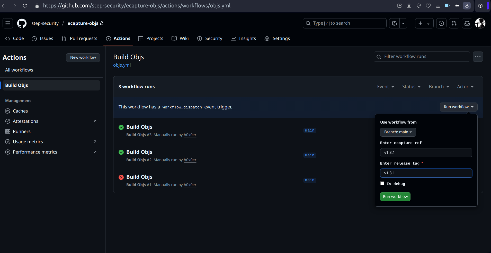

# Build eCapture assets

## Build Steps

### Step-1: Triggering workflow

- Goto Actions tab and choose `Build Objs` workflow
- Click on `Run Workflow`
- Enter the latest ecapture tag from [here](https://github.com/gojue/ecapture/tags) in `ecapture-ref` and `release-tag` fields
    - Optional: Tick `is-debug` to disable pushing changes/creating tag
- Click on green `Run Workflow` to trigger the build

### Step-2: Publish the release

Once workflow finishes from step-1

- Goto [release](https://github.com/step-security/ecapture-objs/releases) and  click `draft new-release`

- Click `select tag`, choose the `tag` used in previous step-1

- Hit `Publish release`

## Guidelines

- Make sure `ecapture-ref` and `release-tag` fields have same value